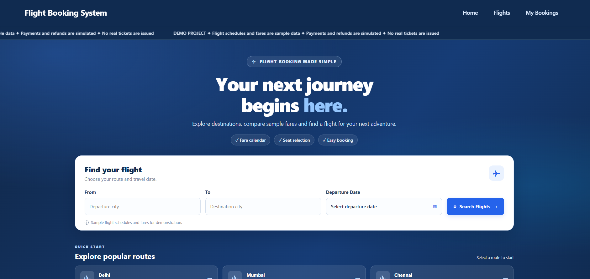
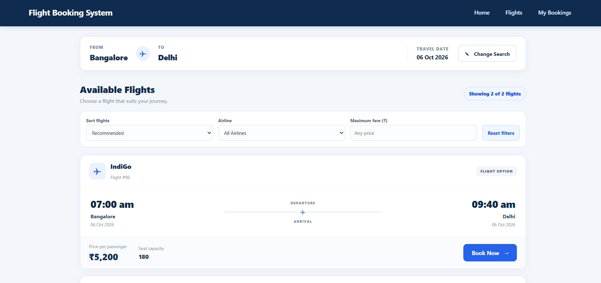
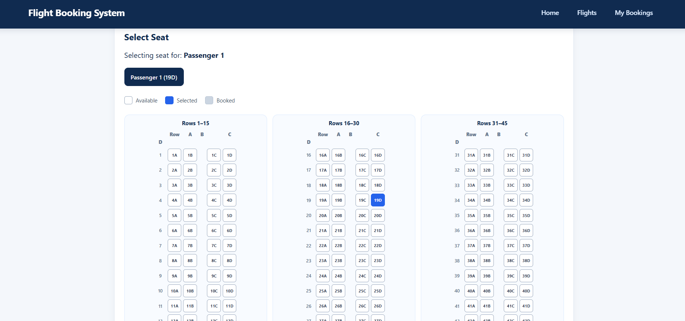
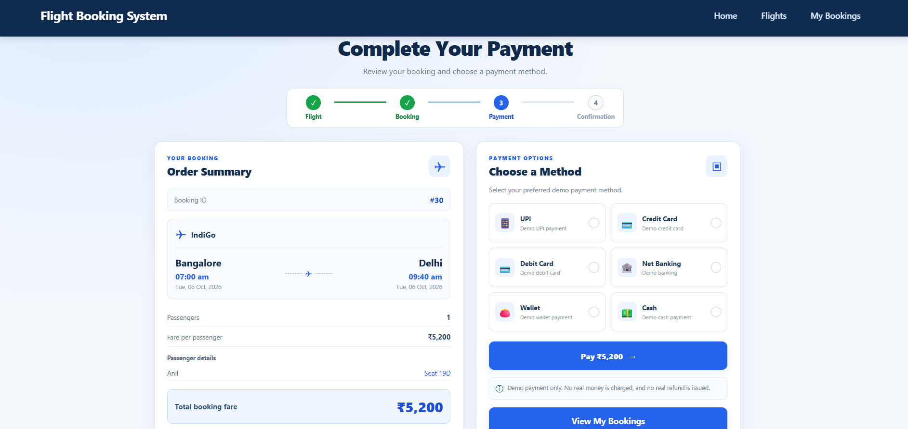
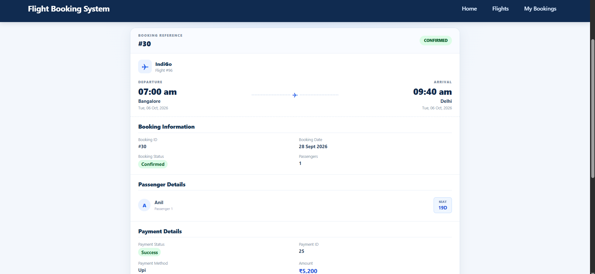
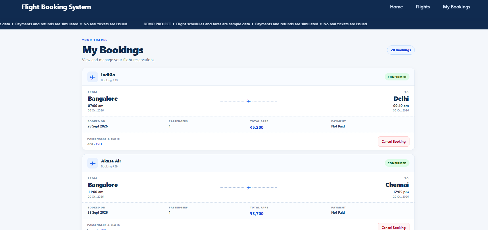

<div align="center">

# ✈️ Flight Booking System

### A full-stack flight reservation demo built with Spring Boot, React, and PostgreSQL

<p>
  
  
  
  
  
</p>

<p>
  Search sample flights, select seats, create bookings, and try a simulated payment flow.
</p>

</div>

---

## 📸 Application Screenshots

> Add your own screenshots to `docs/screenshots/` using the filenames shown below. These relative paths will render once the image files are added.

| Home & Flight Search | Available Flights |
|---|---|
|  |  |
| Passenger & Seat Selection | Payment |
|  |  |
| Booking Confirmation | My Bookings |
|  |  |

---

## ✨ Features

- **Flight search:** Search flights by source, destination, and departure date.
- **City autocomplete:** Get source and destination suggestions while entering a route.
- **Fare calendar:** View sample daily fares for a selected route and date range.
- **Flight results:** Review airline, route, departure and arrival times, fare, and seat capacity.
- **Sorting and filters:** Sort by fare or departure time; filter by airline and maximum fare.
- **Seat selection:** View seat availability and select seats for passengers.
- **Passenger management:** Add passenger details and select seats for each passenger.
- **Booking management:** View bookings and their current status.
- **Demo payment:** Select a payment mode and complete the simulated payment flow.
- **Cancellation status:** Cancel eligible bookings and display the recorded refund status.
- **Responsive interface:** Pages are styled for desktop and smaller screens.

## 🧰 Technology Stack

| Area | Technologies |
|---|---|
| Backend | Java, Spring Boot |
| Persistence | Spring Data JPA, Hibernate |
| Database | PostgreSQL |
| Frontend | React, Vite, JavaScript, CSS |
| HTTP client | Axios |
| Date picker | `react-calendar` |
| API testing | Postman |
| Version control | Git and GitHub |

## 🏗️ Project Structure

```text
Flight-Booking-System/
├── src/
│   └── main/
│       ├── java/com/jsp/
│       │   ├── config/
│       │   ├── controller/
│       │   ├── dto/
│       │   ├── entity/
│       │   ├── exception/
│       │   ├── repository/
│       │   └── service/
│       └── resources/
├── frontend/
│   ├── public/
│   ├── src/
│   │   ├── components/
│   │   ├── pages/
│   │   └── services/
│   ├── package.json
│   └── vite.config.js
├── docs/
│   └── screenshots/
├── pom.xml
└── README.md
```

*The tree highlights the main application areas; exact package and file names may vary as the project evolves.*

## ⚙️ Prerequisites

Install the following before running the project:

- A JDK version compatible with the project's `pom.xml`
- Maven (or the included Maven Wrapper, if present)
- Node.js and npm
- PostgreSQL

## 🚀 Run Locally

### 1. Clone the repository

```bash
git clone https://github.com/Shivanand117/Flight-Booking-System.git
cd Flight-Booking-System
```

### 2. Configure PostgreSQL

Create a PostgreSQL database for the application (the local development database used during development is `FlightBookinDB`).

Configure the datasource in `src/main/resources/application.properties` (or the corresponding configuration file used by the project). For example:

```properties
spring.datasource.url=jdbc:postgresql://localhost:5432/FlightBookinDB
spring.datasource.username=${DB_USERNAME}
spring.datasource.password=${DB_PASSWORD}
```

Set `DB_USERNAME` and `DB_PASSWORD` in your local environment, or use your own local-only configuration. **Do not commit real credentials.**

The application has been run locally on port `8091`; check the project configuration if that changes.

### 3. Start the backend

From the repository root:

```bash
mvn spring-boot:run
```

If Maven is not installed and the project contains `mvnw`, use the wrapper instead:

```bash
./mvnw spring-boot:run
```

The local API base URL used by the frontend is:

```text
http://localhost:8091
```

### 4. Install and start the frontend

Open a terminal in the frontend directory:

```bash
cd frontend
npm ci
npm run dev
```

Open the local Vite URL printed in the terminal (typically `http://localhost:5173`).

The frontend's Axios base URL is configured in `frontend/src/services/api.js`. Keep it aligned with the backend URL when running locally.

### 5. Create a production frontend build

From `frontend/`:

```bash
npm run build
```

Vite writes the production assets to `frontend/dist/`. This directory is generated output and should not normally be committed.

## 🔌 API Overview

The application exposes REST endpoints for flight search, booking, and payment. The following are the main routes implemented in the project:

| Method | Endpoint | Purpose |
|---|---|---|
| `GET` | `/flights` | List flights |
| `POST` | `/flights` | Create a flight |
| `GET` | `/flights/{id}` | Get flight details |
| `PUT` | `/flights/{id}` | Update a flight |
| `DELETE` | `/flights/{id}` | Delete a flight where permitted |
| `GET` | `/flights/search` | Search by source, destination, and date |
| `GET` | `/flights/suggestions/sources` | Source-city suggestions |
| `GET` | `/flights/suggestions/destinations` | Destination-city suggestions |
| `GET` | `/flights/calendar-fares` | Daily sample fares for a route |
| `GET` | `/flights/{id}/booked-seats` | Retrieve booked seats |
| `POST` | `/bookings` | Create a booking |
| `GET` | `/bookings` | List bookings |
| `GET` | `/bookings/{id}` | Get booking details |
| `PUT` | `/bookings/{id}` | Update a booking |
| `DELETE` | `/bookings/{id}` | Delete a booking where permitted |
| `PUT` | `/bookings/{id}/cancel` | Cancel a booking |
| `POST` | `/payments` | Submit a simulated payment |

For query parameters and request/response fields, refer to the corresponding controller and DTO classes.

## 🧪 Verification

The following checks were completed during development:

- Frontend production build using `npm run build`
- Frontend dependency installation using `npm ci`
- Backend test command `mvn clean test` (one test discovered and passed in the reported run)
- Manual testing of flight search, booking, payment, confirmation, and cancellation flows

## ⚠️ Demo and Data Disclaimer

This repository is an educational demonstration, not a production airline booking service.

- Flight schedules, seat capacities, and fares are sample data and are not live airline inventory.
- Payments are simulated. No real payment is collected.
- A displayed `REFUNDED` status is a database status in this demo; it does not represent a transfer of real money.
- Do not enter real payment card, banking, or other sensitive information.
- Production use would require additional security, operational, payment-gateway, and deployment work.

## 🔮 Possible Future Enhancements

- Integrate a real payment provider and verified refund workflow.
- Add authentication, authorization, and user-specific booking history.
- Add production deployment configuration and environment-based API URLs.
- Add broader automated tests and CI checks.
- Introduce server-side pagination and filtering if the flight dataset grows.

## 👨‍💻 Author

**Shivanand Avaradi**

- GitHub: [Shivanand117](https://github.com/Shivanand117)
- LinkedIn: [Shivanand Avaradi](https://www.linkedin.com/in/shivanand-avaradi-a21312336/)

---

<div align="center">
  <sub>Built as a full-stack learning project.</sub>
</div>


## Live Deployment

**Frontend (Live Website):**  
https://flight-booking-frontend-de78.onrender.com/

**Backend (Spring Boot REST API):**  
https://flight-booking-system-1-xkpd.onrender.com/flights

The frontend is deployed on Render, the backend is
built with Spring Boot, and PostgreSQL is hosted on Neon.

Note: This project uses sample flight data and simulated
payments for demonstration purposes.